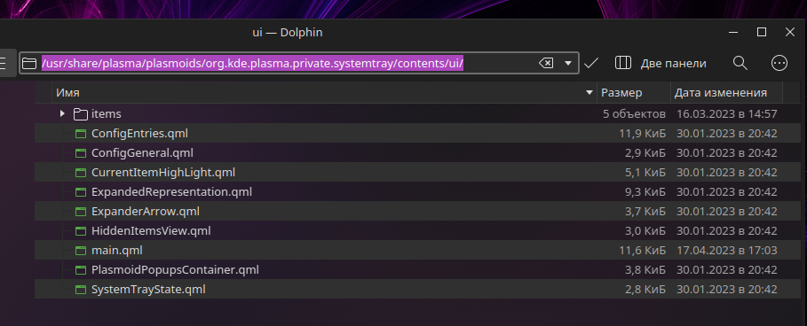

# How to rearrange the KDE Plasma systemtray
Simple workaround to rearrange the KDE Plasma systemtray

> **NOTE**: File `main.qml` in repository contains some width changes for icons for my look and feel.

### 1. Create multiple system trays for each icons you want to rearrange


But right now you will get something like this


### 2. Go to `/usr/share/plasma/plasmoids/org.kde.plasma.private.systemtray/contents/ui/` directory



### 3. Open `main.qml` file

### 4. Find `ExpanderArrow` block

### 5. Find the `visible:` property and edit it so:

```qml
visible: visibleLayout.count != 1
```

This will make the arrow appear if there are no items in the tray

### 6. Logout or restart shell or reboot

### Now how it looks in my case


